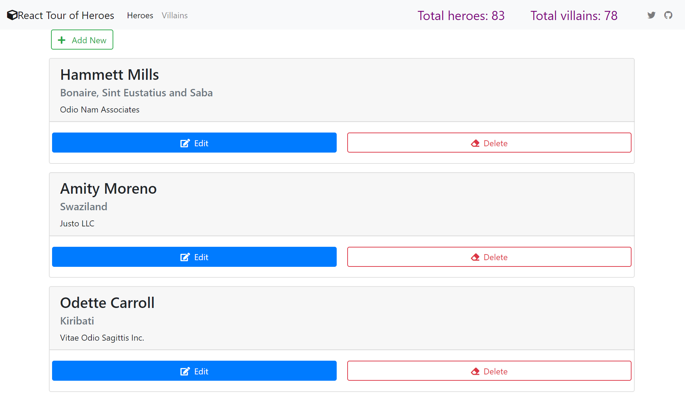

# Mobx State Tree Course

```zsh
$ git clone https://github.com/webmasterdevlin/mobx-state-tree-course-starter.git
$ cd mobx-state-tree-course-starter
$ npm installs
$ npm run start:fullstack
```

The React app, and the fake web service will run concurrently.


